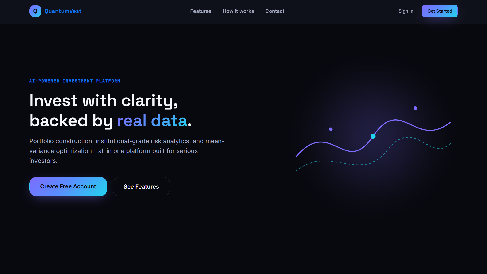

# QuantumVest


## Predictive Investment Analytics Platform

QuantumVest is an investment analytics platform: a Flask backend for portfolios, watchlists, risk metrics, and on-chain data, paired with a React web dashboard and a React Native (Expo) mobile app. Portfolio optimization and risk calculations (VaR, CVaR, Sharpe, efficient frontier) run in the live API; a separate ensemble of forecasting models (LSTM, XGBoost, LightGBM, CatBoost) exists as a standalone, untied library.

<div align="center">
  
</div>

## Table of Contents

- [Overview](#overview)
- [Project Structure](#project-structure)
- [Feature Status](#feature-status)
- [Technology Stack](#technology-stack)
- [Architecture](#architecture)
- [Installation and Setup](#installation-and-setup)
- [Running the Stack](#running-the-stack)
- [API Surface](#api-surface)
- [Testing](#testing)
- [CI/CD Pipeline](#cicd-pipeline)
- [Documentation](#documentation)
- [Contributing](#contributing)
- [License](#license)

## Overview

QuantumVest demonstrates an investment analytics workflow across a real, runnable codebase. The application tier (backend, smart contracts, and two clients) is wired and covered by tests, with real scipy-based portfolio optimization, VaR/CVaR risk calculations, and a genuine web3.py integration reading Solidity contracts. Two separate, disconnected libraries sit alongside it: `code/ai_models` (an ensemble of forecasting models) and `code/backend/pipeline` (a second, independent prediction pipeline built on yfinance and its own LSTM model), neither of which the live API currently calls.

## Project Structure

```
QuantumVest/
├── code/
│   ├── backend/                 # Flask application
│   │   ├── app/api/v1/          # routes.py: auth, portfolios, watchlists,
│   │   │                        # assets, risk, blockchain
│   │   ├── app/services/        # portfolio, quant, risk, financial, blockchain
│   │   ├── app/core/            # auth, security (JWT, MFA)
│   │   ├── pipeline/            # Separate, unwired yfinance + LSTM prediction pipeline
│   │   └── tests/               # Backend test suite (unit and integration)
│   ├── blockchain/              # Truffle project
│   │   ├── contracts/           # PortfolioManager, TrendAnalysis (Chainlink feed),
│   │   │                        # QuantumVestOracle, QuantumVestToken, Governance, Staking
│   │   └── test/                # Truffle test suite
│   └── ai_models/               # Standalone forecasting ensemble (LSTM, XGBoost,
│                                # LightGBM, CatBoost), not imported by the backend
├── web-frontend/                # React (Vite) dashboard
├── mobile-frontend/             # React Native + Expo app
├── infrastructure/              # Docker, Kubernetes, Terraform, Ansible, monitoring
├── scripts/                     # Setup, run, test, and deploy scripts
├── docs/                        # Documentation (this directory)
└── README.md
```

## Feature Status

### Application tier (wired and tested)

| Component                  | Details                                                                                                                                                                                                                                                                      |
| :------------------------- | :--------------------------------------------------------------------------------------------------------------------------------------------------------------------------------------------------------------------------------------------------------------------------- |
| **API**                    | Flask backend exposing `/api/v1` endpoints for auth, portfolios, watchlists, assets, risk, and blockchain, plus `/api/v1/health`.                                                                                                                                            |
| **Auth**                   | JWT sessions (PyJWT) with bcrypt password hashing, plus an MFA module in `app/core/security.py`. `SECRET_KEY` falls back to a placeholder default with no check that rejects it in production.                                                                               |
| **Portfolio optimization** | A scipy-based efficient frontier and minimum-variance optimizer, plus Sharpe ratio, max drawdown, and beta calculations.                                                                                                                                                     |
| **Risk service**           | VaR (historical and parametric), CVaR, stress testing, and concentration-risk calculations, run in-process.                                                                                                                                                                  |
| **Compliance and alerts**  | Portfolio compliance checks and a user-alerting service, backed by SQLAlchemy models.                                                                                                                                                                                        |
| **Smart contracts**        | Truffle-managed Solidity contracts: `PortfolioManager`, `TrendAnalysis` (reads a real Chainlink `AggregatorV3Interface` price feed), `QuantumVestOracle`, `QuantumVestToken`, a governance contract, and a staking contract, read and written via a genuine web3.py service. |
| **Web dashboard**          | React app (plain JavaScript, Vite) with Chart.js, Framer Motion, and React Router, covering Home, Dashboard, Portfolios, Predictions, Blockchain, Settings, and authentication screens.                                                                                      |
| **Mobile app**             | React Native (Expo) app covering Home, Dashboard, Portfolios, Portfolio Detail, Predictions, Risk Analytics, Blockchain, Watchlist, Settings, and authentication screens, with React Navigation and Detox for end-to-end tests.                                              |

### Research tier (library modules, not wired to a live endpoint)

| Component                      | Details                                                                                                                                                                           |
| :----------------------------- | :-------------------------------------------------------------------------------------------------------------------------------------------------------------------------------- |
| **Forecasting ensemble**       | An LSTM (TensorFlow/Keras), XGBoost, LightGBM, and CatBoost ensemble in `code/ai_models`, with its own training scripts.                                                          |
| **Second prediction pipeline** | A separate yfinance-based data pipeline with its own LSTM model and feature engineering, in `code/backend/pipeline`, independent of both `code/ai_models` and the live Flask app. |

Neither library is imported by `code/backend/app`, so predictions from either one aren't currently reachable through the API.

## Technology Stack

| Area                       | Technology                                                                                             |
| :------------------------- | :----------------------------------------------------------------------------------------------------- |
| Backend API                | Python 3.11+, Flask, Flask-SQLAlchemy, Flask-Migrate, Flask-Caching, Gunicorn                          |
| Auth                       | PyJWT, bcrypt, an in-house MFA module                                                                  |
| Data layer                 | SQLAlchemy 2, Alembic, prometheus-client (`/metrics`)                                                  |
| Quant                      | NumPy, SciPy, statsmodels (portfolio optimization and risk metrics)                                    |
| ML / Forecasting (library) | TensorFlow/Keras (LSTM), XGBoost, LightGBM, CatBoost, scikit-learn                                     |
| Market data                | yfinance                                                                                               |
| Blockchain                 | Solidity, Truffle, web3.py, Chainlink (one price feed, in `TrendAnalysis.sol`)                         |
| Web frontend               | React 18, JavaScript, Vite, Chart.js, Framer Motion, React Router, axios                               |
| Mobile frontend            | React Native, Expo, React Navigation, React Native Paper, react-native-chart-kit                       |
| Infrastructure             | Docker, Docker Compose, Kubernetes, Terraform, Ansible                                                 |
| Monitoring                 | Prometheus, Grafana                                                                                    |
| CI/CD                      | GitHub Actions                                                                                         |
| Testing                    | pytest (backend), Truffle (contracts), Jest (web and mobile), Playwright (web e2e), Detox (mobile e2e) |

The app-level `code/docker-compose.yml` provisions PostgreSQL, but `code/backend/requirements.txt` only includes a MySQL driver (PyMySQL); the infrastructure-level `infrastructure/docker-compose.yml` and Kubernetes manifests provision MySQL instead. If you're running the app-level compose file, you'll need to add a PostgreSQL driver yourself, or point `DATABASE_URL` at a MySQL instance to match what's actually installed.

## Architecture

```
Clients
  ├── web-frontend (React)               ── HTTP/JSON ──┐
  └── mobile-frontend (React Native)     ── HTTP/JSON ──┤
                                                        ▼
Backend (Flask, /api/v1)
  ├── Routes    auth, portfolios, watchlists, assets, risk, blockchain
  ├── Core       JWT auth, MFA
  ├── Services    portfolio, quant (efficient frontier), risk (VaR/CVaR),
  │              financial (compliance, alerts), blockchain (web3.py)
  └── Data layer   SQLAlchemy + Alembic

Blockchain (Truffle / Solidity)
  PortfolioManager · TrendAnalysis (Chainlink feed) · QuantumVestOracle
  QuantumVestToken · QuantumVestGovernance · QuantumVestStaking

Standalone libraries (not called by the backend)
  code/ai_models        LSTM, XGBoost, LightGBM, CatBoost ensemble
  code/backend/pipeline  yfinance + a second, independent LSTM pipeline
```

See [docs/ARCHITECTURE.md](docs/ARCHITECTURE.md) for detail.

## Installation and Setup

Prerequisites: Python 3.11+ and Node.js 18+.

```bash
git clone https://github.com/quantsingularity/QuantumVest.git
cd QuantumVest

# Blockchain
cd code/blockchain
npm install

# Backend
cd ../backend
python -m venv .venv && source .venv/bin/activate
pip install -r requirements.txt

# Web frontend
cd ../../web-frontend
npm install

# Mobile frontend
cd ../mobile-frontend
npm install
```

For an automated setup:

```bash
git clone https://github.com/quantsingularity/QuantumVest.git
cd QuantumVest
./scripts/setup_quantumvest_env.sh
./scripts/run_quantumvest.sh
```

Full, environment-specific instructions are in [docs/INSTALLATION.md](docs/INSTALLATION.md).

## Running the Stack

```bash
# 1) Supporting services (from code/, Docker required)
docker compose up -d db

# 2) Local chain (from code/blockchain)
npx truffle develop

# 3) Backend (from code/backend, venv active)
python -c "from app import create_app; create_app('development').run(host='0.0.0.0', port=5000)"
# or, for a production-style run:
gunicorn wsgi:app --bind 0.0.0.0:5000

# 4) Web dashboard (from web-frontend)
npm run dev

# 5) Mobile app (from mobile-frontend)
npm start                          # press w for web, a for Android, i for iOS
```

See [docs/USAGE.md](docs/USAGE.md) and [docs/CONFIGURATION.md](docs/CONFIGURATION.md).

## API Surface

Base URL `http://localhost:5000/api/v1`.

| Group      | Highlights                                                                                                    |
| :--------- | :------------------------------------------------------------------------------------------------------------ |
| Auth       | `register`, `login`, `logout`, `refresh`, `forgot-password`, `reset-password`, `profile`, `change-password`   |
| Portfolios | list/create, `{id}`, `{id}/transactions`, `{id}/performance`, `{id}/optimize`                                 |
| Assets     | list, `search`                                                                                                |
| Watchlists | list/create, `{id}`, `{id}/items`                                                                             |
| Risk       | `var`, `metrics`                                                                                              |
| Blockchain | `status`, `trend`, `market-data`, `market-data/{ticker}`, `token/balance/{address}`, `oracle/{asset_address}` |

Full request and response shapes are in [docs/API.md](docs/API.md).

## Testing

```bash
# Backend (from code/backend)
pytest

# Smart contracts (from code/blockchain)
npx truffle test

# Web (from web-frontend)
npm test

# Mobile (from mobile-frontend)
npm test
```

The backend suite has 8 unit test files and 4 integration test files. The Truffle suite has 7 files covering the contracts. The web dashboard has 7 test files (Jest, plus Playwright for end-to-end); the mobile app has 4 (Jest, plus Detox configured for end-to-end).

## CI/CD Pipeline

GitHub Actions (`.github/workflows/cicd.yml`) runs four jobs on push, pull request, and manual dispatch:

| Job                  | Depends on          | What it does                                                                       |
| :------------------- | :------------------ | :--------------------------------------------------------------------------------- |
| Code Quality Checks  | -                   | Python formatter checks (autoflake, black) and a repository-wide Prettier check    |
| Backend Tests        | Code Quality Checks | Runs the pytest suite with coverage and uploads the coverage report as an artifact |
| Frontend Build       | Code Quality Checks | Installs dependencies and produces the production web build (no test step)         |
| Blockchain Contracts | Code Quality Checks | Compiles the contracts with Truffle and runs the contract test suite               |

There is currently no CI job for the mobile app.

## Documentation

| Document                                           | Contents                               |
| :------------------------------------------------- | :------------------------------------- |
| [docs/README.md](docs/README.md)                   | Documentation index                    |
| [docs/ARCHITECTURE.md](docs/ARCHITECTURE.md)       | System architecture                    |
| [docs/API.md](docs/API.md)                         | REST API reference                     |
| [docs/INSTALLATION.md](docs/INSTALLATION.md)       | Setup for all components               |
| [docs/CONFIGURATION.md](docs/CONFIGURATION.md)     | Environment variables and config       |
| [docs/USAGE.md](docs/USAGE.md)                     | Running and using the platform         |
| [docs/CLI.md](docs/CLI.md)                         | Helper scripts reference               |
| [docs/FEATURE_MATRIX.md](docs/FEATURE_MATRIX.md)   | Feature status, implemented vs planned |
| [docs/TROUBLESHOOTING.md](docs/TROUBLESHOOTING.md) | Common issues and fixes                |
| [docs/CONTRIBUTING.md](docs/CONTRIBUTING.md)       | Contribution guide                     |
| [docs/examples/](docs/examples/)                   | Worked examples                        |

## Contributing

See [docs/CONTRIBUTING.md](docs/CONTRIBUTING.md).

## License

This project is licensed under the MIT License - see the [LICENSE](LICENSE) file for details.
